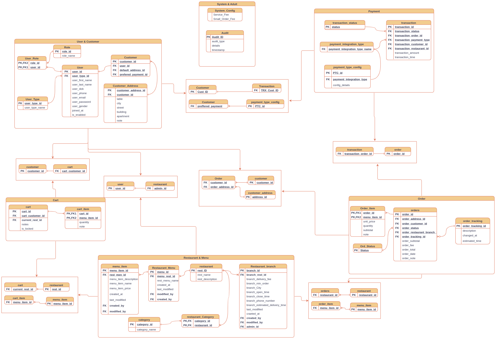

# Food Delivery System

## Overview

A full-featured food delivery platform built with Spring Boot, following a feature-based architecture. The system allows customers to browse restaurants, place orders, and track deliveries in real time. Restaurant owners can manage their menus, monitor incoming orders, and view business reports. A system admin oversees the platform — managing users, restaurants, and generating operational reports.

The platform covers the full delivery lifecycle: user registration and authentication, restaurant and menu management, cart and order processing, customer account management, payment integration with third-party providers, and a reporting dashboard for both admins and restaurant owners.

---

## Actors

| Actor | Description |
|---|---|
| **Customer** | Registers, browses restaurants, manages a cart, places and tracks orders, and manages their account and payment preferences. |
| **Restaurant Owner** | Registers and manages their restaurant, creates and maintains menus, processes incoming orders, and views restaurant-level reports. |
| **System Admin** | Manages the entire platform — enables/disables accounts and restaurants, monitors system-wide statistics, and generates platform-level reports. |

---

## Features & API Endpoints

### 1. User Registration & Authentication

Handles all identity and access concerns: sign-up flows for customers and restaurants, authentication, OTP verification, social login, and role-based permissions.

| Method | Endpoint | Description |
|---|---|---|
| POST | `/auth/signup` | Sign up |
| POST | `/auth/login` | Login |
| POST | `/auth/logout` | Logout |
| POST | `/auth/forget-password` | Forget password |
| POST | `/auth/verify-otp` | Email / SMS OTP verification |
| GET / PUT | `/users/{id}/profile` | View / update user profile |
| POST | `/auth/social-login` | Social media authentication |
| PATCH | `/users/{id}/status` | Enable or disable account |

---

### 2. Restaurant & Menu Management

Allows restaurant owners to register and manage their restaurant, maintain menus, and lets customers search and discover restaurants.

| Method | Endpoint | Description |
|---|---|---|
| POST | `/restaurants` | Register restaurant |
| PUT | `/restaurants/{id}` | Update restaurant |
| PATCH | `/restaurants/{id}/status` | Enable / disable restaurant |
| GET | `/restaurants` | View all restaurants |
| GET | `/restaurants/top-rated` | Top rating restaurants |
| GET | `/restaurants/recommendations` | Restaurant recommendations |
| GET | `/restaurants/search` | Search restaurants |
| POST | `/restaurants/{id}/menus` | Create a new menu |
| PUT | `/restaurants/{id}/menus/{menuId}` | Update menu |
| DELETE | `/restaurants/{id}/menus/{menuId}` | Delete menu |
| PATCH | `/restaurants/{id}/menus/{menuId}/status` | Enable / disable menu |
| GET | `/restaurants/{id}/menus/history` | View history list of menus |
| GET | `/restaurants/{id}/menus/search` | Search menu items |

---

### 3. Cart Management

Manages a customer's shopping cart — adding and modifying items, viewing cart contents, and proceeding to checkout.

| Method | Endpoint | Description |
|---|---|---|
| POST | `/cart/items` | Add to cart |
| PUT | `/cart/items/{itemId}` | Modify cart item |
| GET | `/cart` | View cart |
| DELETE | `/cart` | Clear cart |
| DELETE | `/cart/items/{itemId}` | Remove item from cart |
| POST | `/cart/checkout` | Checkout |
| PATCH | `/cart/items/{itemId}/quantity` | Update item quantity |

---

### 4. Order Management

Handles the full order lifecycle from placement to completion, including cancellations, status updates, and order history for restaurants.

| Method | Endpoint | Description |
|---|---|---|
| POST | `/orders` | Place order |
| DELETE | `/orders/{id}` | Cancel order (by customer or restaurant) |
| PATCH | `/orders/{id}/status` | Update order status |
| GET | `/restaurants/{id}/orders` | Restaurant order history |
| GET | `/orders/{id}/summary` | Order summary |
| GET | `/orders/{id}` | Order details |

> **Notifications:** Order confirmation is sent via email / SMS upon placement. Customers are notified on every order status change via push notification and SMS/email.

---

### 5. Customer Management

Covers customer self-service features: order history, address book, payment preferences, ratings, order tracking, and account management.

| Method | Endpoint | Description |
|---|---|---|
| GET | `/customers/{id}/orders` | Customer order history |
| GET / PUT | `/customers/{id}/payment-settings` | View / update preferred payment settings |
| GET / POST / PUT / DELETE | `/customers/{id}/addresses` | Address management |
| PATCH | `/customers/{id}/deactivate` | Deactivate account |
| POST | `/orders/{id}/rating` | Submit rating & comments |
| GET | `/orders/{id}/tracking` | Track order status |

> **Additional:** In-app customer support chat is available via chat integration.

---

### 6. Payment Integration

Handles payment processing through third-party providers, transaction history, receipt generation, and payment auditing and validation.

| Method | Endpoint | Description |
|---|---|---|
| POST | `/payments` | Initiate payment (3rd-party integration) |
| GET | `/payments/transactions` | View payment transactions |
| GET | `/payments/transactions/{id}/receipt` | Generate transaction receipt |

> **Additional:** Payment auditing, verification, and validation are applied on all transactions.

---

### 7. Dashboard & Reports

Provides statistical endpoints and downloadable reports for both system admins and individual restaurants.

#### System Admin

| Method | Endpoint | Description |
|---|---|---|
| GET | `/admin/stats/restaurants/count` | Count restaurants |
| GET | `/admin/stats/customers/count` | Count customers |
| GET | `/admin/stats/customers/active/count` | Count active customers |
| GET | `/admin/stats/orders/daily` | Daily orders count |
| GET | `/admin/stats/orders/monthly` | Monthly total orders |
| GET | `/admin/stats/orders/cancelled/daily` | Daily cancelled orders |
| GET | `/admin/stats/orders/cancelled/monthly` | Monthly cancelled orders |
| GET | `/admin/stats/transactions/daily` | Daily transactions (count & revenue) |
| GET | `/admin/stats/transactions/monthly` | Monthly transactions (count & revenue) |
| GET | `/admin/reports/transactions/daily` | Generate daily transactions report |
| GET | `/admin/reports/transactions/monthly` | Generate monthly transactions report |

#### Restaurant Owner

| Method | Endpoint | Description |
|---|---|---|
| GET | `/restaurants/{id}/stats/orders/daily` | Daily orders count |
| GET | `/restaurants/{id}/stats/orders/not-delivered/daily` | Daily orders not delivered count |
| GET | `/restaurants/{id}/stats/orders/monthly` | Monthly total orders count |
| GET | `/restaurants/{id}/stats/orders/cancelled/daily` | Daily cancelled orders |
| GET | `/restaurants/{id}/stats/orders/cancelled/monthly` | Monthly cancelled orders |
| GET | `/restaurants/{id}/stats/transactions/daily` | Daily transactions (count & revenue) |
| GET | `/restaurants/{id}/stats/transactions/monthly` | Monthly transactions (count & revenue) |
| GET | `/restaurants/{id}/reports/transactions/daily` | Generate daily transactions report |
| GET | `/restaurants/{id}/reports/transactions/monthly` | Generate monthly transactions report |

---

## ER Diagram

